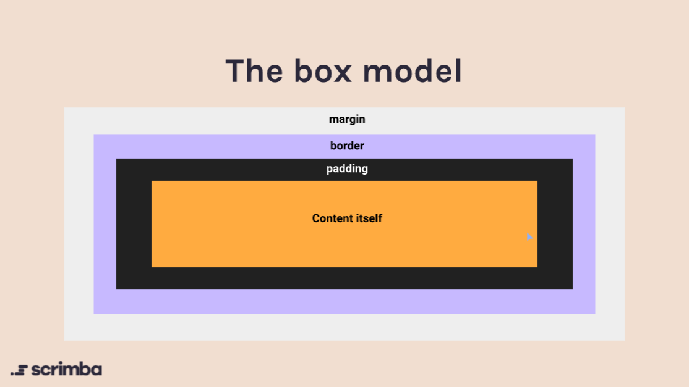

# CSS Box Model

## About

Basics
: Most elements are block level by default.
They're stack on top of the other with ***width as 100%*** and ***height is 0(auto)***. The height will grow as the content inside the element grows.

---

---

### **Margin property**

It is the empty space **outside** an element.

- margin-left
- margin-right
- margin-bottom
- margin-top
- margin: top right bottom left | top&bottom left&right | top left&right bottom | all

---

### **Padding property**

It is the empty space **inside** an element. Also, padding will be
include the background colour.

- padding-left
- padding-right
- padding-bottom
- padding-top
- padding: top right bottom left | top&bottom left&right | top left&right bottom | all

> Note:
Margin vs Padding
If you need empty space, use margin.
If you want more background use padding.

---

### **Border property**

It is the empty space **inside** an element. Also, padding will be
include the background colour.

- border-width
- border-style
- border-color
- border: width style color

> Note: By default the border color is white.
> We can also control each side independently using a shorthand

---
